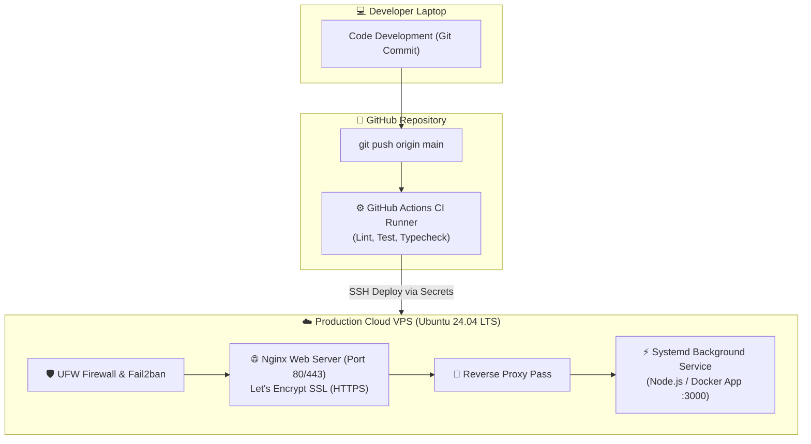

import { Aside } from "@astrojs/starlight/components";
import LessonCompletion from "../../../components/mdx/LessonCompletion";

<Aside title="👋 မင်္ဂလာပါ">
  **Linux, Cloud VPS & DevOps Fundamentals** သင်ရိုးမှ ကြိုဆိုပါတယ်။ ဤသင်ရိုးသည် ခင်ဗျား၏ Code များကို Local စက်ထဲတွင်သာ မဟုတ်ဘဲ အင်တာနက်လောကထဲရှိ **Production Cloud Server** ပေါ်တွင် ၂၄ နာရီ မရပ်မနား တည်ငြိမ်စွာ အလုပ်လုပ်နိုင်စေရန် အခြေခံမှစ၍ အဆင့်ဆင့် လေ့ကျင့်ပေးမည့် လက်တွေ့ သင်ရိုးဖြစ်ပါတယ်။
</Aside>

## အဘယ်ကြောင့် Linux & DevOps ကို Developer တိုင်း တတ်မြောက်ထားသင့်သနည်း?

ယနေ့ခေတ် ကမ္ဘာ့ Web Server များ၊ Cloud ပလက်ဖောင်းများ (AWS, Google Cloud, DigitalOcean, Hetzner) နှင့် Docker Containers များ၏ **၉၀% ကျော်သည် Linux (အထူးသဖြင့် Ubuntu / Debian)** ပေါ်တွင် အခြေခံ လည်ပတ်နေကြပါတယ်။

ခင်ဗျားအနေဖြင့် မည်မျှပင် ကောင်းမွန်သော Code များ ရေးသားနိုင်ပါစေ —
- Server ပေါ်သို့ မည်သို့ တင်ရမည်ကို မသိပါက၊
- Error တက်၍ Server ကျသွားသည့်အခါ Auto-restart မလုပ်နိုင်ပါက၊
- Hacker များ၏ SSH Brute-force တိုက်ခိုက်မှုဒဏ်ကို မကာကွယ်နိုင်ပါက၊
Application တစ်ခုသည် Production အဆင့်သို့ ရောက်ရှိနိုင်မည် မဟုတ်ပါ။

---

## Production Deployment Architecture (စနစ်တစ်ခုလုံး၏ ဖွဲ့စည်းပုံ)

ဤသင်ရိုးတွင် အောက်ဖော်ပြပါ **Full Production Workflow** တစ်ခုလုံးကို အစအဆုံး ကိုယ်တိုင် တည်ဆောက်သွားပါမည်:

---

## Introduction

- Section 1: Linux, Cloud VPS & DevOps မိတ်ဆက် (Course Overview)

## Module 1: Linux CLI အခြေခံ

- Section 2: Navigation & File System
- Section 3: Permissions & Users Management

## Module 2: System Management

- Section 4: APT Package Manager
- Section 5: Processes & Systemd Services

## Module 3: Server Security & Hardening

- Section 6: SSH Keys & Access Hardening
- Section 7: UFW Firewall & Fail2ban

## Module 4: Nginx Web Server & SSL

- Section 8: Nginx Fundamentals & Static Hosting
- Section 9: Reverse Proxy & Let's Encrypt SSL

## Module 5: CI/CD Pipeline Automation

- Section 10: GitHub Actions CI Basics
- Section 11: Automated VPS Deployment

## ကြိုတင် လိုအပ်ချက်များ (Prerequisites)

- အခြေခံ Terminal အသုံးပြုဖူးသူ (Mac, Linux သို့မဟုတ် Windows WSL / Git Bash)။
- Git & GitHub အသုံးပြုပုံ အခြေခံ နားလည်ထားခြင်း။
- Cloud VPS တစ်လုံး (DigitalOcean, Hetzner, AWS EC2 သို့မဟုတ် VirtualBox / Local Ubuntu VM ဖြင့်လည်း အခမဲ့ လိုက်ပါ စမ်းသပ်နိုင်ပါသည်)။

---

## စတင် လေ့လာရန် အဆင်သင့်ဖြစ်ပြီလား?

ပထမဆုံး သင်ခန်းစာဖြစ်သည့် **Linux Terminal အခြေခံနှင့် File System စီမံခန့်ခွဲခြင်း** သို့ တိုက်ရိုက် သွားရောက် လေ့လာလိုက်ပါ:

👉 **[Module 1: Navigation & File System သို့ သွားမည် →](/linux-devops/01-cli-basics/01-navigation-and-files)**

<LessonCompletion
  client:idle
  lessonId="linux-devops-00-overview"
  lessonTitle="Course Overview"
/>