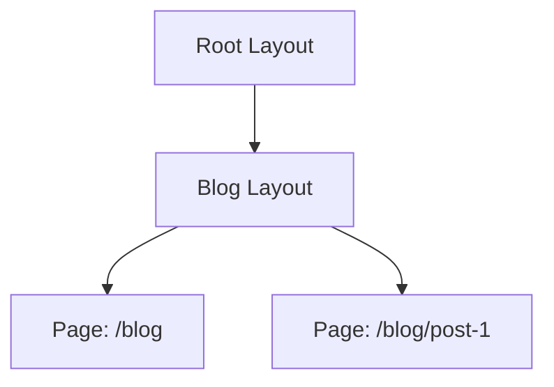

import { Aside } from "@astrojs/starlight/components";

<Aside type="tip" title="🎯 သင်ခန်းစာ ရည်ရွယ်ချက်">
  App တစ်ခုကို nested layouts နှင့် pages များအဖြစ် စံနမူနာပြုနိုင်စေရန်၊ Next.js သည် folders များကို URLs နှင့် မည်သို့ ယှဉ်တွဲပြီး shared UI ကို တစ်ကြိမ်တည်း render လုပ်ပေးသည်ကို နားလည်စေရန် ဖြစ်ပါတယ်။
</Aside>

## ရှင်းလင်းချက်

Next.js App Router သည် file-system based routing ကို အသုံးပြုပြီး folder များ၏ တည်ဆောက်ပုံအရ URLs များကို အလိုအလျောက် သတ်မှတ်ပေးပါတယ်။ App တစ်ခုရှိ core files နှစ်ခုမှာ `page.tsx` နှင့် `layout.tsx` ဖြစ်ပြီး `page.tsx` သည် route တစ်ခု၏ သီးသန့် UI ကို render လုပ်ပြီး `layout.tsx` သည် children များကို ပတ်ထားသော wrapper ဖြစ်ကာ navigation များအကြား ဆက်လက်တည်ရှိနေပါတယ်။ Nested routes များကို nested folders များဖြင့် ကိုယ်စားပြုပြီး `src/app/blog` folder တွင်းရှိ ဖိုင်များသည် `/blog` URL နှင့် သက်ဆိုင်ပါတယ်။ Root layout သည် **required** ဖြစ်ပြီး `<html>` နှင့် `<body>` များပါဝင်ရပါတယ်။ `/blog` မှ `/blog/post-1` သို့ navigation ပြုလုပ်သောအခါ အတွင်းဘက် `page` သာလျှင်ပြောင်းလဲပြီး မိဘ layouts များသည် ပြန်လည် render မဖြစ်သောကြောင့် navigation မြန်ဆန်ပြီး client-side state များကို ထိန်းသိမ်းထားနိုင်ပါတယ်။ Dynamic params များကို `[slug]` ကဲ့သို့ folder name ဖြင့် လက်ခံပြီး page ၏ `params` props မှတစ်ဆင့် ရရှိပါတယ်။

## The two core files (Core Files နှစ်ခု)

| File       | Renders                   | Shared? |
| ---------- | ------------------------- | ------- |
| `page.tsx` | The unique UI for a route | No - one per route |
| `layout.tsx` | A wrapper around children | Yes - persists across navigations |

```tsx
// src/app/layout.tsx - root layout
export default function RootLayout({ children }: { children: React.ReactNode }) {
  return (
    <html lang="en">
      <body className="antialiased">
        <header>Site header</header>
        {children}
        <footer>Site footer</footer>
      </body>
    </html>
  );
}
```

```tsx
// src/app/page.tsx - route "/"
export default function HomePage() {
  return <h1>Welcome home</h1>;
}
```

## Nested routes = nested folders (Nested Routes များသည် Nested Folders များဖြစ်သည်)

```
src/app
├── layout.tsx
├── page.tsx        → /
└── blog
    ├── layout.tsx  → wraps all /blog/* pages (e.g. sidebar)
    └── page.tsx    → /blog
```

```tsx
// src/app/blog/layout.tsx
export default function BlogLayout({ children }: { children: React.ReactNode }) {
  return (
    <div className="flex gap-6">
      <aside>Categories…</aside>
      <main>{children}</main>
    </div>
  );
}
```

**Root layout သည် required** ဖြစ်ပြီး `<html>` နှင့် `<body>` များ ပါဝင်ရမည်။

## How layouts render (Layouts များ မည်သို့ Render လုပ်သည်)

`/blog` မှ `/blog/post-1` သို့ navigation ပြုလုပ်သောအခါ အတွင်းဘက် `page` သာလျှင် ပြောင်းလဲပြီး `blog/layout` နှင့် root layout တို့သည် ပြန်လည် render **မဖြစ်ပါဘူး**။ ၎င်းကြောင့် navigation မြန်ဆန်ပြီး client-side state များကို ထိန်းသိမ်းထားနိုင်ပါတယ်။



## Pages receive dynamic params (Pages များသည် Dynamic Params များကို လက်ခံသည်)

```tsx
// src/app/blog/[slug]/page.tsx
export default async function PostPage({ params }: { params: Promise<{ slug: string }> }) {
  const { slug } = await params;
  return <article>{slug}</article>;
}
```

## Activity

Sidebar ပါသော `src/app/dashboard/layout.tsx` ကို ဖန်တီးပြီး `dashboard/page.tsx` နှင့် `dashboard/settings/page.tsx` တို့ကို ထည့်ပါ။ နှစ်ခုကြား navigating လုပ်နေစဉ် sidebar သည် ဆက်လက် mounted ဖြစ်နေကြောင်း စစ်ဆေးပါ။