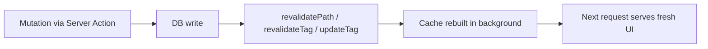

import { Aside } from "@astrojs/starlight/components";

<Aside type="tip" title="🎯 သင်ခန်းစာ ရည်ရွယ်ချက်">
  Cached pages များကို မြန်ဆန်စွာ ထားရှိနိုင်ပြီး stale content များ ထာဝရသက်တမ်းမကုန်ဘဲ မကျန်ရစ်စေရန် - time-based နှင့် on-demand revalidation တို့ဖြင့် ပြုလုပ်နည်းကို နားလည်စေရန် ဖြစ်ပါတယ်။
</Aside>

## ရှင်းလင်းချက်

Revalidation ဆိုသည်မှာ cache လုပ်ထားသော data များသည် stale မဖြစ်တော့စေရန် သတ်မှတ်ထားသော အချိန် သို့မဟုတ် အချိန်မရွေးခေါ်ယူသည့် trigger အရ ပြန်လည် မွမ်းမံခြင်း ဖြစ်ပါတယ်။ Time-based revalidation တွင် `cacheLife` profile ဖြင့် cached output ကို မည်မျှကြာအောင် serve လုပ်နိုင်သည်ကို သတ်မှတ်နိုင်ပြီး ဥပမာ `cacheLife("hours")` ဖြင့် ၅ မိနစ်တွင် stale ဖြစ်ကာ နာရီအလိုက် revalidate ဖြစ်ပြီး ၁ ရက်တွင် expire ဖြစ်ပါတယ်။ ပိုမိုသိမ်မွေ့စွာ ထိန်းချုပ်ရန်အတွက် `cacheLife({ stale, revalidate, expire })` object ကိုလည်း ပေးပို့နိုင်ပါတယ်။ `cacheTag("products")` ဖြင့် cached output ကို tag လုပ်ထားပါက `revalidateTag("products")` ဖြင့် tag အလိုက် တိကျစွာ purge လုပ်နိုင်ပြီး `revalidatePath("/shop")` ဖြင့် path အလိုက် ပြန်လည် render လုပ်နိုင်ပါတယ်။ `revalidateTag`/`revalidatePath` တို့သည် stale-while-revalidate semantics ဖြစ်ပြီး fresh content ကို background တွင် load လုပ်နေစဉ် ယခင်အကြောင်းအရာကို ချက်ချင်း serve လုပ်ပါတယ်။ ကိုယ်တိုင်ရထားသော fresh data ရှိလျှင် `updateTag` ဖြင့် update ဖြစ်ပြီးသား cached value ကို canonical အဖြစ် သတ်မှတ်နိုင်ပါတယ်။

## Time-based revalidation (အချိန်အခြေပြု Revalidation)

`cacheLife` profile သည် cached output ကို မည်မျှကြာအောင် serve လုပ်နိုင်သည်ကို ထိန်းချုပ်ပါတယ်:

```tsx
// app/lib/data.ts
import { cacheLife } from "next/cache";

export async function getProducts() {
  "use cache";
  cacheLife("hours"); // stale after 5m, revalidated hourly, expires in 1 day
  return db.query("SELECT * FROM products");
}
```

ပိုမိုသိမ်မွေ့စွာ ထိန်းချုပ်ရန်အတွက် object တစ်ခုကို ပေးပို့ပါ:

```tsx
"use cache";
cacheLife({
  stale: 3600, // 1 hour until stale
  revalidate: 7200, // 2 hours until revalidated in background
  expire: 86400, // 1 day until expired
});
```

> **သိထားသင့်သည်:** "Short-lived" caches (`seconds` profile, `revalidate: 0` သို့မဟုတ် ၅ မိနစ်အောက် `expire`) များကို prerenders များမှ ဖယ်ထုတ်ပြီး request time တွင် dynamic holes များဖြစ်လာပါတယ်။

## Tagging cached data (Cached Data များကို Tagging လုပ်ခြင်း)

`cacheTag` သည် cached output ကို label လုပ်ပေးပြီး တိကျစွာ purge လုပ်နိုင်စေပါတယ်:

```tsx
// app/lib/data.ts
import { cacheTag } from "next/cache";

export async function getProducts() {
  "use cache";
  cacheTag("products");
  return db.query("SELECT * FROM products");
}
```

## On-demand revalidation (On-Demand Revalidation)

```tsx
// app/lib/actions.ts
import { revalidatePath, revalidateTag } from "next/cache";
import { updateTag } from "next/cache";

export async function updateProduct(id: string) {
  // 1. mutate data
  await db.product.update({ where: { id }, data: { title: "New" } });

  // 2. clear stale caches
  revalidateTag("products");          // by tag, stale-while-revalidate
  revalidatePath("/shop");            // by path
  updateTag("products");              // swap to new cached output
}
```

- **`revalidateTag` / `revalidatePath`** - stale-while-revalidate semantics ဖြစ်ပြီး fresh content ကို background တွင် load လုပ်နေစဉ် ယခင်အကြောင်းအရာကို ချက်ချင်း serve လုပ်ပါတယ် (catalog/blog content များအတွက် အကြံပြုသည်)။
- **`updateTag`** - update ဖြစ်ပြီးသား cached value ကို canonical အဖြစ် မှတ်ယူပါတယ် (fresh data ကို ကိုယ်တိုင်ရယူထားပြီးသောအခါ အသုံးဝင်ပါတယ်)။

## The full flow (လုပ်ငန်းစဉ် အပြည့်အစုံ)



## Activity

သင့် products query ကို `cacheTag("products")` ဖြင့် tag လုပ်ပြီး product တစ်ခုကို ပြင်ဆင်သည့် admin action တစ်ခု ထည့်ပါ။ `revalidateTag("products")` ကို ခေါ်ပြီးနောက် shop page တွင် အပြောင်းအလဲ ပေါ်လာကြောင်း စစ်ဆေးပါ။