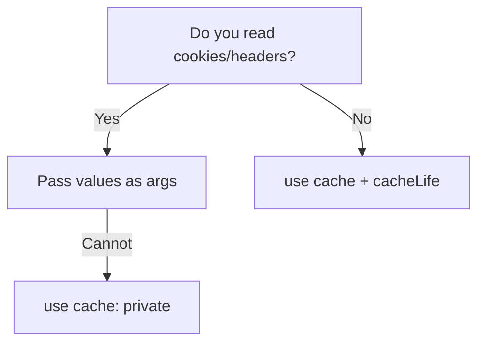

import { Aside } from "@astrojs/starlight/components";

<Aside type="caution" title="🎯 သင်ခန်းစာ ရည်ရွယ်ချက်">
  Request-scoped values (cookies/headers) များကို shared cache scopes ပြင်ပတွင် ထားရှိခြင်းအားဖြင့် user တစ်ဦး၏ cached data ကို အခြားသူတစ်ဦးသို့ ပေါက်ကြားခြင်းမှ ရှောင်ရှားနိုင်ရန် ဖြစ်ပါတယ်။
</Aside>

## ရှင်းလင်းချက်

Cache Components များကို အသုံးပြုသောအခါ `use cache` ဖြင့် သိမ်းဆည်းသည့် output သည် function ၏ inputs များပေါ် အခြေခံ၍ key သတ်မှတ်ခံရပါတယ်။ သို့သော် cached function အတွင်းတွင် `cookies()` သို့မဟုတ် `headers()` များကို ဖတ်မိပါက ၎င်း output သည် request lifetime အတွက်သာ သက်တမ်းရှိသော private cache entry ဖြစ်လာပြီး shared caches နှင့် user data ရောနှောမိလျှင် cross-user leakage ဖြစ်နိုင်ခြေရှိပါတယ်။ ထို့ကြောင့် cookies/headers များကို cached scope ၏ ပြင်ပတွင် ဖတ်ပြီး တန်ဖိုးများကို arguments အဖြစ် ပေးပို့သင့်ပါတယ်။ ထိုသို့ပြုလုပ်ပါက userId arguments များ မတူသည့်အတွက် cache keys များ သီးခြား ဖြစ်ပေါ်ပြီး user အချင်းချင်း data ပေါက်ကြားခြင်း မရှိပါဘူး။ Refactor မလုပ်နိုင်သော အခြေအနေများတွင်မူ `use cache: private` ဖြင့် request-scoped သဘောထားကို ရရှိစေနိုင်ပါတယ်။

## The cache leak problem

`use cache` နှင့်အတူ cached output သည် function ၏ inputs များဖြင့် key သတ်မှတ်ပါတယ်။ Cached function တစ်ခု၏ **အတွင်းတွင်** `cookies()` သို့မဟုတ် `headers()` ကို ဖတ်ပါက output သည် တူညီသော request lifetime အတွက်သာ ရှိသည့် "private" cache entry ဖြစ်လာပါတယ် — သို့သော် shared caches နှင့် user data ရောနှောခြင်းသည် cross-user leakage ကို ဖြစ်စေနိုင်ပါတယ်။

## The rule: pass auth data as arguments

Cookies/headers များကို cached scope ၏ **ပြင်ပ**တွင် ဖတ်ပြီး တန်ဖိုးများကို arguments အဖြစ် ပေးပို့ပါ:

```tsx
// app/lib/data.ts
import { cacheLife } from "next/cache";

export async function getFeed(userId: string | null) {
  "use cache";
  cacheLife("minutes");

  if (!userId) return publicPosts();
  return fetch(`https://api.example.com/feed?user=${userId}`).then((r) => r.json());
}
```

```tsx
// app/page.tsx
import { cookies } from "next/headers";

export default async function Page() {
  const session = cookies().get("session")?.value;
  const feed = await getFeed(session ?? null);
  return <Feed items={feed} />;
}
```

`userId` arguments များ မတူပါက cache keys များလည်း မတူသည် → **cross-user leakage လုံးဝ မရှိ**ပါ။

## When you cannot refactor

Cookies/headers များကို cached scope အတွင်းတွင်သာ ထားရန် လိုအပ်ပါက (compliance, legacy code စသည့် အခြေအနေများ) **private** cache ကို အသုံးပြုပါ:

```tsx
export async function getUserProfile() {
  "use cache: private";
  cacheLife(60);
  const session = cookies().get("session")?.value;
  return fetchProfile(session);
}
```

`use cache: private` သည် entries များကို request-scoped သဘောထား ပေးနိုင်ပြီး users များကို သီးခြား ခွဲထားပေးပါတယ်။

## What NOT to do

```tsx
// ❌ cookies read inside a shared cache scope
export async function getProfile() {
  "use cache";
  cacheLife("hours");
  const session = cookies().get("session");
  return db.profile.findFirst({ where: { sessionId: session.value } });
}
```

## Decision flow



## Activity — လေ့ကျင့်ခန်း

Authenticated feed တစ်ခုကို cache scopes များကို argument-only အဖြစ် ထားရှိလျက် `getFeed(userId)` အဖြစ် refactor လုပ်ပါ၊ ထို့နောက် session မတူသော users နှစ်ဦးသည် မတူညီသော cached keys များကို ရရှိကြောင်း အတည်ပြုပါ။