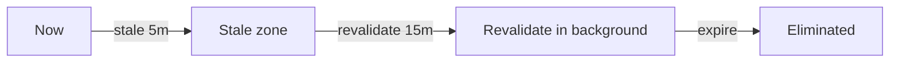

import { Aside } from "@astrojs/starlight/components";

<Aside type="note" title="🎯 သင်ခန်းစာ ရည်ရွယ်ချက်">
  Stale cached content များကို မည်သည့်အခါ upgrade, replace သို့မဟုတ် ဖယ်ရှားကြောင်း အတိအကျ သိရှိပြီး freshness ကို ခန့်မှန်း တွက်ချက်နိုင်ရန် ဖြစ်ပါတယ်။
</Aside>

## ရှင်းလင်းချက်

Revalidation ဆိုသည်မှာ cache ထဲတွင် သိမ်းဆည်းထားသော ခေတ်မမီတော့သော (stale) content များကို နောက်ဆုံး အခြေအနေ fresh values များဖြင့် ပြန်လည် အစားထိုးခြင်း ဖြစ်ပါတယ်။ Cache entry တိုင်းတွင် `stale`, `revalidate` နှင့် `expire` ဟူသော တိုင်မာ သုံးခု ပါဝင်ပြီး ၎င်းတို့သည် content ၏ အသက်တမ်း အဆင့်များကို သတ်မှတ်ပေးပါတယ်။ Stale အဆင့်တွင် content ကို ဆက်လက် ဝန်ဆောင်မှုပေးသေးသော်လည်း refresh လိုအပ်ကြောင်း သတ်မှတ်ပြီး revalidate မှစတင်၍ stale-while-revalidate mechanism အားဖြင့် background တွင် ပြန်လည် generate လုပ်ပါတယ်။ Expire အချိန် ရောက်ပါက entry ကို ဖယ်ရှားပြီး fresh value အသစ် တွက်ချက်ပါတယ်။ `revalidateTag`/`revalidatePath` ကဲ့သို့သော on-demand revalidation များသည် mutation ပြီးနောက် ချက်ချင်း ပြန်လည် စတင်စေပြီး `updateTag` မှာမူ သင်တွက်ချက်ထားပြီးသား fresh value ကို ချက်ချင်း လဲလှယ်ပေးနိုင်ပါတယ်။ Cache ကို in-memory (server process အတွင်း) သို့မဟုတ် `use cache: remote` (platform cache handler ပေါ်) ဖြင့် သိမ်းဆည်းနိုင်ပါတယ်။

## The three timers

Cache entry တိုင်းတွင် ပါရှိပါတယ်:

| Field         | Meaning                                                      |
| ------------- | ------------------------------------------------------------ |
| `stale`       | After this, the value is still served but **needs refresh**  |
| `revalidate`  | After this, a **stale-while-revalidate** swap begins         |
| `expire`      | After this, the entry **is removed** and a fresh value is computed |

`cacheLife` သည် profiles များကို timestamps များသို့ mapping လုပ်ပေးပြီး ဥပမာအားဖြင့် `hours` = stale 5m / revalidate 1h / expire 1d ဖြစ်ပါတယ်။

## Stale-while-revalidate

Cached value တစ်ခုသည် stale ဖြစ်နေသော်လည်း revalidate မလုပ်ရသေးပါက:

1. Request ရောက်ရှိသည် → **stale** entry ကို ဝန်ဆောင်မှုပေးသည် (မြန်ဆန်ပြီး စောင့်ဆိုင်းစရာမလို)
2. Background job သည် function ကို ပြန်လည် run ကာ entry ကို ပြန်လည် generate လုပ်သည်
3. နောက်လာသော requests များသည် fresh value ကို ရရှိသည်

ဤသည်မှာ `revalidateTag`/`revalidatePath` များ အသုံးပြုသည့် default revalidation strategy ဖြစ်ပါတယ်။

## On-demand vs time-based

| Trigger         | API                                               |
| --------------- | ------------------------------------------------- |
| Every *N* minutes | `cacheLife("hours")` on a `use cache` scope     |
| After a mutation  | `revalidatePath` / `revalidateTag` / `updateTag` |
| Immediate rebuild | `updateTag` swaps in the already-fresh value    |

## Who holds the cache?

- In-memory cache (**default**) သည် server process အတွင်းတွင် တည်ရှိသည် — လျင်မြန်သည်၊ single-instance ဖြစ်သည်
- `use cache: remote` သည် platform cache handler ဆီသို့ ပေးအပ်သည် (network round-trip၊ ပုံမှန်အား per-hit cost၊ instances များအကြား scale လုပ်နိုင်သည်)

## Revalidation guarantees

- Revalidation သည် interval တစ်ခုအတွင်း route တစ်ခုအတွက် **တစ်ကြိမ်သာ** လည်ပတ်သည် (deduplicated)
- Cache keys (build ID, function ID, args) များသည် mutation တစ်ခုက မည်သည့် entries များကို သက်ရောက်နိုင်သည်ကို ဆုံးဖြတ်သည်
- `updateTag` သည် အသေးစိတ်အကျဆုံး ဖြစ်သည်: ၎င်းသည် tagged value တစ်ခုတည်းကိုသာ သင်တွက်ချက်ထားပြီးသား fresh value ဖြင့် အစားထိုးသည်

## Activity — လေ့ကျင့်ခန်း

Counter တစ်ခုတွင် `cacheLife({ stale: 30, revalidate: 300, expire: 3600 })` သတ်မှတ်ပါ၊ `updateTag` ဖြင့် mutate လုပ်ပါ၊ ထို့နောက် windows သုံးခုအကြား served values များ မည်ကဲ့သို့ ပြောင်းလဲသည်ကို ကြည့်ရှုပါ။