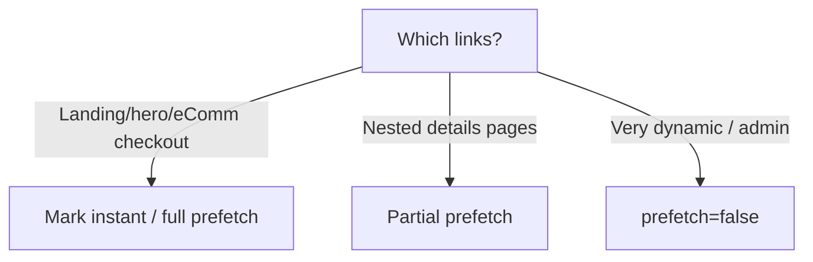

import { Aside } from "@astrojs/starlight/components";

<Aside type="tip" title="🎯 သင်ခန်းစာ ရည်ရွယ်ချက်">
  Click နှိပ်လိုက်သည်နှင့် content ချက်ချင်း ပေါ်လာစေရန် ဘာကို prefetch လုပ်ရမည်၊ ဘာကို eagerly activate လုပ်ရမည်၊ ဘာကို on demand ဆွဲမည်ကို ဆုံးဖြတ်တတ်လာစေရန် ဖြစ်ပါတယ် — **full prefetch**, **partial prefetching** နှင့် **instant** flag တို့ကို မှန်ကန်စွာ ရွေးချယ်သုံးတတ်လာမည်။
</Aside>

## ရှင်းလင်းချက်

Browser သည် link တစ်ခုကို နှိပ်လိုက်သည့်အခါ မျက်နှာပြင်အသစ်ကို ပြသရန် server ဆီမှ router payload ကို ယူပြီး render လုပ်ရသောကြောင့် ထို round trip ကြောင့် navigation နှေးကွေးတတ်ပါတယ်။ Next.js သည် ၎င်းကို ကျော်လွှားရန် link များကို ကြိုတင် သိမ်းဆည်းပေးသည့် **prefetching** ယန္တရားကို ထောက်ပံ့ပေးပြီး full prefetch သည် route payload တစ်ခုလုံးကို ကြိုတင်ပို့ပေးကာ partial prefetch သည် static shell အသေးစားကို ကြိုတင်ပို့ပြီး dynamic data များကို click လုပ်မှသာ ဆွဲပါတယ်။ အချို့ route များသည် hover လုပ်သည်နှင့် ချက်ချင်း activate ဖြစ်သင့်သည့်အတွက် ၎င်းကို မှတ်သားရန် segment config သို့မဟုတ် next.config မှ instant option ကို သတ်မှတ်နိုင်ပါတယ်။ Landing/hero page များနှင့် e-commerce checkout ကဲ့သို့ အမြန်ဆုံး မြန်ရမည့် page များကို instant / full prefetch ပေးပြီး nested detail pages များကို partial prefetch ၊ admin ကဲ့သို့ dynamic ဖြစ်သော page များကို prefetch=false ထားသင့်ပါတယ်။ Network panel တွင် RSC payload request များနှင့် `next/link` prefetch များကို စောင့်ကြည့်၍ activation time ကို တိုင်းတာပြီး performance ကို စစ်ဆေးသင့်ပါတယ်။

## ဘာက navigation ကို နှေးစေသလဲ?

Click နှိပ်ပြီး content အသစ်ပေါ်ချိန် ကြားကာလသည် **router payload ကို ဆွဲရန် round trip + render လုပ်ချိန်** ဖြစ်ပါတယ်။ Prefetching က ထို round trip ကို မျက်ကွယ်ပြုလုပ်ပေးပါတယ်။

## Prefetch levels

- **Full prefetch** (default with `prefetch`) — route payload တစ်ခုလုံးကို ကြိုတင် ပို့ပေးခြင်း
- **Partial prefetch** — static shell အသေးစားကို ကြိုတင် ပို့ပေးပြီး dynamic data များကို click လုပ်မှ ဆွဲခြင်း
- **No prefetch** (`prefetch={false}`) — အားလုံးကို click ၌သာ ဆွဲခြင်း

## Marking pages "instant"

အချို့ page များသည် partial prefetching အတွင်း၌ပင် ချက်ချင်း activate ဖြစ်သင့်ပါတယ်။ Segment flag ကို သတ်မှတ်ပါ:

```ts
// app/shop/instant.ts  or in next.config smart defaults
export const config = {
  // activate this route eagerly when a link is hovered
};
```

Runtime option ဖြင့် **instant navigation** ကို application တစ်ခုလုံးအတွက် တစ်ချိန်တည်း ဖွင့်နိုင်ပါတယ်:

```ts
// next.config.ts
const nextConfig: NextConfig = {
  partialPrefetching: true,
  turbopack: {
    instant: "...", // via config or per-segment
  },
};
```

## Which routes should be instant?



## Measure it

Network tab တွင် **RSC payloads** နှင့် `next/link` prefetch request များကို စောင့်ကြည့်ပါ:

- Full prefetch သည် click မလုပ်မီ request ကြီးတစ်ခု `?_rsc=` ကို ပြသပါတယ်
- Partial က shell request အသေးစားကို ပြပြီး click လုပ်မှ chunk ကို ဆွဲပါတယ်
- `act()` ပုံစံ Safari/Chrome trace တွင် activation time သည် hover-click အချိန်၌ သုညနီးပါး ဖြစ်သင့်ပါတယ်

## Activity

လေ့ကျင့်ခန်း: List → detail flow တွင် detail page ကို `instant` ဟု သတ်မှတ်ပြီး React DevTools profiling ဖြင့် click-to-paint ကို တိုင်းတာကာ `prefetch={false}` နှင့် နှိုင်းယှဉ်ကြည့်ပါ။