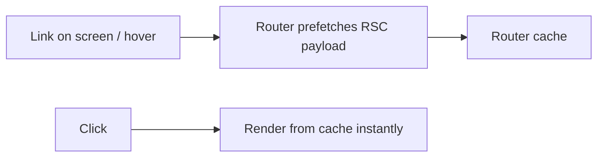

import { Aside } from "@astrojs/starlight/components";

<Aside type="tip" title="🎯 သင်ခန်းစာ ရည်ရွယ်ချက်">
  အသုံးပြုသူက click မလုပ်ခင်မှာ သင့် app က ဘယ်အရာတွေကို fetch လုပ်မယ်ဆိုတာ အတိအကျ သိထားနိုင်ဖို့၊ ဒါမှ navigation တွေက instant ဖြစ်နေမှာ ဖြစ်ပါတယ်။
</Aside>

## ရှင်းလင်းချက်

Prefetching ဆိုတာ အသုံးပြုသူ မနှိပ်ခင်မှာ (Link ပေါ် pointer ထောက်တာ သို့မဟုတ် Link က viewport ထဲ ဝင်လာတာမျိုး) Next.js Router က destination route ရဲ့ **RSC payload** ကို ကြိုတင် ဆွဲယူထားတဲ့ ယန္တရား တစ်ခု ဖြစ်ပါတယ်။ ဒီလိုကြိုတင် ပြင်ဆင်ထားလို့ user က click လုပ်လိုက်တာနဲ့ network round trip မလိုတော့ဘဲ Router cache ထဲမှာ သိမ်းထားတာကို ထပ်ဆင့်ဖတ်ပြီး navigation က ချက်ချင်း instant ဖြစ်သွားပါတယ်။ ဒါပေမဲ့ Prefetching မှာ ပုံစံတွေ ကွာပါတယ် — full prefetch, partial prefetch (partialPrefetching), `prefetch={false}` ဆိုပြီး route တစ်ခုချင်းစီရဲ့ freshness level ကို သင့်လိုအပ်ချက်အလိုက် ထိန်းချုပ်နိုင်ပါတယ်။ Router cache က segment တစ်ခုချင်းစီအလိုက် ခွဲသိမ်းထားလို့ Layout တွေက ဆက်သွားပြီး navigation လုပ်တဲ့အခါမှာ ပြောင်းလဲသွားတဲ့ segment တွေကိုပဲ ပြန်ပြီး refetch လုပ်ပါတယ်။ Network tab မှာ `?_rsc` filter နဲ့ စစ်ကြည့်ရင် ဘယ် route တွေ အပြည့် prefetch ဖြစ်/မဖြစ်၊ ဘယ်ဟာက click ပြီးမှ ပြန် fetch လုပ်လဲဆိုတာ လက်တွေ့ ခန့်မှန်းတွက်နိုင်ပါတယ်။

## What prefetching fetches

Link ပေါ်ကို mouse ထောက်လိုက်တာ (သို့မဟုတ် Link က viewport ထဲ ရောက်လာတာ) ဖြစ်တာနဲ့ Next.js က အဲဒီ route ရဲ့ **RSC payload** ကို ချက်ချင်း request လုပ်ပါတယ်။ ဒါက navigation ကို network round trip ကျော်သွားစေပြီး instant ဖြစ်စေပါတယ်။

## Triggers

| Trigger          | Behavior                          |
| ---------------- | --------------------------------- |
| Viewport entry   | Links prefetch as they scroll in  |
| `prefetch` prop  | Force enable/disable              |
| `router.prefetch(url)` | Programmatic prefetch       |
| Focus/pointer   | Deeper prefetch (instant ready)   |

## Levels of freshness

- **Full prefetch** — route တစ်ခုလုံး အသင့်ဖြစ်နေပါတယ်
- **Partial prefetch** (`partialPrefetching`) — static shell က အသင့်ဖြစ်ပြီး data တွေကို click လုပ်မှ fetch လုပ်ပါတယ်
- **`prefetch={false}`** — click မလုပ်ခင် ဘာမှ မဆွဲပါဘူး

## Router cache boundaries

Prefetch လုပ်ထားတဲ့ ရလဒ်တွေက client ဘက်က router cache ထဲမှာ segment တစ်ခုချင်းစီအလိုက် key ခွဲပြီး သိမ်းထားပါတယ်။ Layout တွေက ဆက်ထားပြီး navigation လုပ်တဲ့အခါမှာ ပြောင်းလဲသွားတဲ့ segment တွေကိုပဲ ပြန် fetch လုပ်ပါတယ်။

## Empirically checking

DevTools → Network → type `?_rsc`:

- click မလုပ်ခင် request တစ်ကြောင်း ပေါ်နေရင် = prefetching အလုပ်လုပ်နေပြီ
- click လုပ်တဲ့အခါ ဒုတိယ request ပေါ်လာရင် = partial/dynamic hole fetching ဖြစ်တယ်
- ကြိုတင် request လုံးဝ မရှိရင် = prefetch disabled ဖြစ်တယ်

## Tuning

- App ကြီးတွေအတွက် `optimizing-prefetching` strategy တွေကို enable လုပ်ပါ
- Content များတဲ့ page တွေအတွက် partial shell တွေကို ဦးစားပေးပါ
- Login/dynamic page တွေကို `prefetch={false}` အဖြစ် သတ်မှတ်ပါ

## Activity

Network filter `?_rsc` ကိုဖွင့်ပြီး Link အနည်းငယ်ပေါ်မှာ hover လုပ်ပါ။ ဘယ် route တွေက အပြည့် prefetch ဖြစ်လဲ၊ ဘယ်ဟာက partial ဖြစ်လဲ၊ ဘယ်ဟာက click မလုပ်ခင် လုံးဝ မဆွဲပါဘူးလဲဆိုတာကို စာရင်းပြုစုပါ။