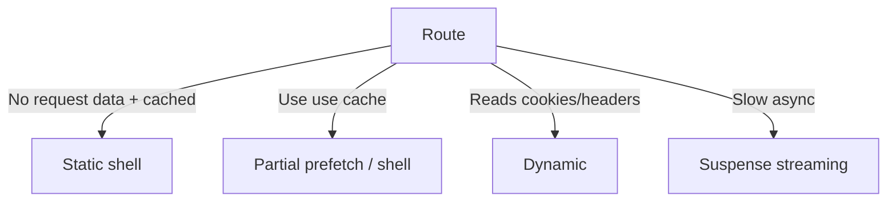

import { Aside } from "@astrojs/starlight/components";

<Aside type="note" title="🎯 သင်ခန်းစာ ရည်ရွယ်ချက်">
  Rendering model ကို နှလုံးသွင်းနိုင်ဖို့ — ဒါဆိုရင် ဘယ် route က ဘယ်လို အပြုအမှုမျိုး ဖြစ်မလဲ run မလုပ်ခင်မှာတင် ကြိုတွက်နိုင်ပါပြီ။
</Aside>

## ရှင်းလင်းချက်

Rendering Philosophy ဆိုတာ Next.js က output တစ်ခုကို ဘယ်လိုဖန်တီးပြီး ဘယ်လောက်ကြာအောင် ပြန်သုံးမလဲဆိုတဲ့ ဆုံးဖြတ်ချက် — **per route, per segment** အလိုက် ခွဲခြားသတ်မှတ်ပါတယ်။ Static ကတော့ တစ်ခါတည်း compute လုပ်ပြီး cache လုပ်၊ edge ကနေ ပြန်ထုတ်ပေးလို့ အမြန်ဆုံး ဖြစ်ပါတယ်။ Dynamic က request တိုင်း compute လုပ်လို့ correct ပေမဲ့ ပိုနှေးပါတယ်။ Streaming က shell ကို အရင်ပေးပြီး ကျန်အပိုင်းတွေကို နောက်မှ ဖြည့်ပေးတဲ့ ပုံစံ ဖြစ်ပါတယ်။ လက်တွေ့စည်းမျဉ်းတွေကတော့ — caching က opt-in ဖြစ်ပြီး `use cache` + `cacheLife` directive နဲ့ သတ်မှတ်ရပြီး cookies()/headers() လို request-scoped data ဖတ်ရင် dynamic ဖြစ်သွားပါတယ်။ နှေးတဲ့ async work တွေကို Suspense နဲ့ ထုပ်နိုင်ပြီး params တွေက async (Promise) ဖြစ်လို့ `await params` လုပ်ရပါတယ်။ ဒီ model အရဆိုရင် static shell တွေက CDN-cache လုပ်လို့ TTFB က milliseconds အနက် မြန်ပြီး dynamic hole တွေက သေးငယ်ပြီး `next build` မှာ route တိုင်းရဲ့ classification ကို ကြည့်နိုင်ပါတယ်။

## The core idea

Next.js က **route တစ်ခုချင်း၊ segment တစ်ခုချင်း**အတွက် output ကို ဘာဖြစ်စေမလဲ ဆုံးဖြတ်ပါတယ်:

- **Static** — တစ်ခါတည်း compute လုပ်၊ cache လုပ်ပြီး edge ကပြန်ထုတ် (အမြန်ဆုံး)
- **Dynamic** — request တိုင်း compute လုပ် (မှန်ပေမဲ့ ပိုနှေး)
- **Streaming** — shell အရင်၊ hole တွေ နောက်မှ



## The rules of thumb

1. **Caching က directives ကတစ်ဆင့် opt-in ဖြစ်ပါတယ်** — `use cache` + `cacheLife` က ဘာတွေ ပြန်သုံးမလဲ သတ်မှတ်ပေးပါတယ်
2. **Request-scoped data က dynamic ရအောင် လုပ်ပါတယ်** — `cookies()`/`headers()` ဖတ်နေရင် pure static ကနေ ထွက်သွားပြီ
3. **Streaming က async work အတွက် default** — နှေးတဲ့ဟာတွေကို `<Suspense>` နဲ့ ထုပ်ပါ
4. **Params တွေက async** — `await params` (request မရောက်ခင် မသိရသေးလို့)

## From the previous model

အရင်ခေတ်က "static by default, dynamic ကို opt in" ဆိုတဲ့ပုံစံ၊ အခုခေတ်ကတော့ **explicit directives** (`use cache`, `use cache: private`) နဲ့ request data အတွက် **runtime-opt-out** ဖြစ်ပါတယ်။ ဒါက အရင်က ရှိခဲ့တဲ့ "why is my page static?" ဆိုတဲ့ ရှုပ်ထွေးမှုတွေကို ဖယ်ရှားပေးပါတယ်။

## Prerender with cache keys

```tsx
export default async function BlogPost({ params }) {
  const { slug } = await params;
  const post = await getPost(slug); // use cache + cacheLife
  return <article>{post.title}</article>;
}
```

သိထားတဲ့ slug တွေ → build အချိန်မှာ prerender လုပ်ပါတယ်; မသိတဲ့ slug တွေ → dynamic render လုပ်ပြီး အဲဒီနောက် ကစပြီး cache ဖြစ်သွားပါတယ်။

## Why this matters for performance

- Static shell တွေက CDN-cacheable ဖြစ်ပါတယ် (ကမ္ဘာ့အနှံ့ TTFB က milliseconds)
- Dynamic hole တွေက သေးငယ်နေမယ် — varying ဖြစ်တဲ့အပိုင်းလေးတွေပဲ live ဖြစ်ပါတယ်
- ကြိုတွက်လို့ရတယ်: `next build` ဖွင့်ရင် route တိုင်းရဲ့ classification ပေါ်ပါတယ်

## Activity

သင့် route သုံးခုအတွက် ဒီ model အရ မျှော်လင့်ထားတဲ့ classification (static shell, partial, ဒါမှမဟုတ် fully dynamic) ကို ခန့်မှန်းရေးပြီး `next build` output နဲ့ စစ်ဆေးပါ။