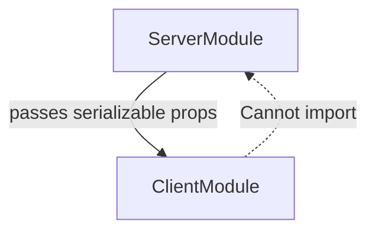

import { Aside } from "@astrojs/starlight/components";

<Aside type="danger" title="🎯 သင်ခန်းစာ ရည်ရွယ်ချက်">
  Boundary ကို မှန်ကန်အောင် သတ်မှတ်နိုင်ဖို့ — ဒါမှ secret code တွေ browser ကို ဘယ်တော့မှ မပါသွားဘဲ RSC payload တွေလည်း သေးငယ်နေမှာ ဖြစ်ပါတယ်။
</Aside>

## ရှင်းလင်းချက်

Server/Client boundary ဆိုတာ file ဘယ်မှာရှိလဲ မဟုတ်ဘဲ module တစ်ခုစီပေါ်မှာ အခြေခံပြီး မှတ်သားတဲ့ နယ်နိမိတ် ဖြစ်ပါတယ်။ Marker မရှိတဲ့ module က Server Module — server မှာပဲ run ပါတယ်။ "use client" ရှိတဲ့ Client Module က initially server-rendered ဖြစ်ပြီး client မှာလည်း run ပါတယ်။ Server Module က ဘာမဆို import လို့ရပြီး Client Module ကတော့ client module တွေကိုပဲ import လို့ရပါတယ် — server-only package တွေ (DB, SDK) ဟာ Server Module ထဲမှာပဲ နေရမယ်။ Boundary ကို ဖြတ်တဲ့ data က **serializable** ဖြစ်ရပါတယ် — string, number, boolean, plain object/array တွေလို RSC-allowable structure တွေပဲ ဖြစ်ပြီး function, class instance, Date-in-state လိုဟာတွေ မပါနိုင်ပါဘူး။ ဒါပေမဲ့ escape hatch ရှိပါသေးတယ် — Client Component က children အနေနဲ့ Server Component တွေကို လက်ခံနိုင်ပြီး အဲဒီ Server Component တွေက server မှာပဲ render ဆက်လုပ်ခံရပါတယ်။ Shared helper တွေကတော့ နှစ်ဖက်စလုံးထဲ inline ဖြစ်သွားလို့ pure ဖြစ်ပြီး သေးငယ်ဖို့ (secret မပါဖို့) အရေးကြီးပါတယ်။

## The boundary model

Boundary က **module-based** ဖြစ်ပါတယ်:

| Module type          | Marker          | Runs on          |
| -------------------- | --------------- | ---------------- |
| Server Module        | (no marker)     | Server only      |
| Client Module        | `"use client"`  | Client + server-rendered initially |
| Server-only code     | `import "server-only"` | Build error if imported client |



## What each may import

- **Server Module** — ဘာမဆို (server ရော client ပါ) import လို့ရပါတယ်
- **Client Module** — client module တွေကိုပဲ import လို့ရပါတယ်
- Server-only package (DB, SDK) တွေဟာ Server Module ထဲမှာပဲ ရှိရပါမယ်

## Passing data across

Boundary ကို **serializable** value တွေပဲ ဖြတ်သန်းလို့ရပါတယ်: strings, numbers, booleans, plain objects/arrays (နဲ့ RSC-allowable structures)။ Functions, class instances, serialization မပါတဲ့ `Date`-in-state tricks တွေ မပါနိုင်ပါဘူး။

```tsx
// page.tsx (server)
import ClientTable from "./client-table";
import { getUsers } from "./data";

export default async function Page() {
  const users = await getUsers();
  return <ClientTable users={users} />; // serializable ✅
}
```

## The "children" escape hatch

Client Component တစ်ခုက **Server Components တွေကို children** အနေနဲ့ လက်ခံနိုင်ပါတယ် — အဲဒီ Server Component တွေက server မှာပဲ render ဆက်လုပ်ပြီး client tree ထဲကို ထည့်သွင်းခံရပါတယ်:

```tsx
// client.tsx
"use client";
export default function Card({ children }: { children: React.ReactNode }) {
  return <div className="card">{children}</div>;
}
```

```tsx
// page.tsx (server)
<Card>
  <ServerOnlyContent />   {/* still server-rendered ✅ */}
</Card>
```

## Shared helpers & the boundary

နှစ်ဖက်စလုံးက import လုပ်တဲ့ code တွေက **နှစ်ဖက်စလုံးထဲမှာ inline** ဖြစ်သွားပါတယ် — ဒါကြောင့် helper တွေကို pure ဖြစ်ပြီး သေးငယ်အောင် (secret မပါအောင်) ထားပါ။

## Detecting mistakes

- Dynamic server imports တွေက build fail ဖြစ်နေတာ
- Server code ထဲမှာ `window is not defined` ဆိုတာမျိုး
- `next build` ရဲ့ client chunks တွေထဲမှာ secrets တွေ မြင်နေရတာ

စည်းမျဉ်း: file တစ်ခုဆို — server လား client လား ဆုံးဖြတ်ပြီး မှားတဲ့လမ်းကို ဘယ်တော့မှ မဖြတ်ပါနဲ့။

## Activity

Table + search box ပါတဲ့ page တစ်ခုရဲ့ dependency graph ကို ဆွဲပါ။ Data query ကို Server Module ထဲ ရွှေ့ပြီး serializable rows တွေကို Client table တစ်ခုဆီ pass လုပ်ပါ၊ client chunks ထဲ server-only import ဝင်မသွားတာကို စစ်ဆေးပါ။