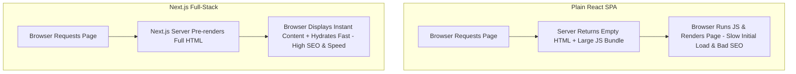

import { Aside } from "@astrojs/starlight/components";

<Aside title="💡 ရည်ရွယ်ချက်">
  Modern Web Development တွင် လူကြိုက်အများဆုံး Full-Stack React Framework ဖြစ်သည့် **Next.js** ၏ အခြေခံ သဘောတရားများနှင့် Vite / Plain React တို့ထက် သာလွန်သော အချက်များကို နားလည်စေရန် ဖြစ်ပါတယ်။
</Aside>

## React သက်သက် (Vite) vs. Next.js Full-Stack

Plain React (Vite/CRA) သည် **Single Page Application (SPA)** ရေးဆွဲရန်အတွက် Client-side UI Library တစ်ခုသာ ဖြစ်ပါတယ်။



---

## Next.js ရဲ့ အဓိက အားသာချက် ၅ ခု

1. **Server-Side Rendering (SSR) & Static Site Generation (SSG):** Page များကို Server ဘက်တွင် Pre-render လုပ်ပေးသဖြင့် **SEO အလွန် ကောင်းမွန်ခြင်း** နှင့် Initial Load Speed မြန်ဆန်ခြင်း။
2. **App Router File-System Routing:** Folder Structure ကို အခြေခံ၍ Nested Routes, Layouts နှင့် Shared Templates များကို အလိုအလျောက် သတ်မှတ်ပေးခြင်း။
3. **Full-Stack Capabilities:** Separate Backend API မလိုအပ်ဘဲ Route Handlers (`api/route.ts`) နှင့် **Server Actions** များကို တိုက်ရိုက် ရေးသားနိုင်ခြင်း။
4. **Built-in Image & Font Optimization:** `<Image />` Component ဖြင့် ပုံများကို WebP Format သို့ အလိုအလျောက် ပြောင်းလဲခြင်းနှင့် Google Fonts များကို Zero-layout-shift ဖြစ်အောင် သိုလှောင်ပေးခြင်း။
5. **Zero Config Production Setup:** TypeScript, TailwindCSS, ESLint နှင့် SWC Compiler တို့ကို အသင့်ပါဝင်ပြီးဖြစ်၍ Setup ပြုလုပ်ရ လွယ်ကူခြင်း။

---

## Next.js App စတင် ဖန်တီးနည်း (`create-next-app`)

Terminal တွင် Command တစ်ကြောင်းတည်း ရိုက်နှိပ်၍ Project အသစ် စတင်နိုင်ပါတယ်:

```bash
npx create-next-app@latest my-next-app \
  --typescript \
  --tailwind \
  --eslint \
  --app \
  --src-dir \
  --import-alias "@/*"
```

## သင်ရိုး လမ်းညွှန် (Course Map)

- **Introduction** — Next.js ဆိုတာ ဘာလဲ? (Full-Stack React Framework)

- **Module 1: Core Getting Started** — App Router, Components, Rendering, Caching, Styling, Optimizations, Upgrade & Production စသည့် အခြေခံ သဘောတရားများ

- **Module 2: Practical Guides (Part 1)** — Layouts/Pages, Dynamic Routes, Client Components, Server Actions အစရှိသော လက်တွေ့လမ်းညွှန်များ

- **Module 3: Practical Guides (Part 2)** — Route Handlers, Middleware (proxy), Forms, Caching, Metadata & SEO လက်တွေ့လမ်းညွှန်များ

- **Module 4: Practical Guides (Part 3)** — Testing, Static Exports, Streaming, TailwindCSS, Third-party Libraries, Upgrading, Videos နှင့် View Transitions

- **Module 5: API Reference - Directives** — `use cache`, `use cache private`, `use cache remote`, `use client`, `use server` Directives များ

- **Module 6: API Reference - Components** — `font`, `form`, `image`, `link`, `script` Components များ

- **Module 7: API Reference - File Conventions** — `page`, `layout`, `template`, `loading`, `error`, `route` အစရှိသော အထူးဖိုင်များ

- **Module 8: Metadata Files & Route Segment Config** — `app-icons`, `manifest`, `opengraph-image`, `robots`, `sitemap` နှင့် `dynamic-params`, `runtime` ကဲ့သို့ Route Config များ

- **Module 9: API Reference - Functions (Part 1)** — `cookies`, `headers`, `fetch`, `redirect`, `not-found` အစရှိသော Core Functions များ

- **Module 10: API Reference - Functions (Part 2)** — `revalidatePath`, `revalidateTag`, `useRouter`, `useSearchParams` အစရှိသော Functions/Hooks များ

- **Module 11: Configuration, TypeScript & Tooling** — `next.config`, TypeScript, ESLint, CLI, Adapters, Edge Runtime, Turbopack

- **Module 12: Architecture & Glossary** — Glossary, Accessibility, Fast Refresh, Compiler နှင့် Supported Browsers

- **Module 13: Mini Project - Full-Stack Blog** — သင်ယူခဲ့သမျှ အရာအားလုံးကို ပေါင်းစပ်၍ Full-Stack Blog တစ်ခု အဆင့်ဆင့် တည်ဆောက်ခြင်း

- **Module 14: Next.js + MongoDB ToDo Project** — သင်ယူခဲ့သော Next.js (App Router) နည်းပညာများကို အသုံးချပြီး Database အဖြစ် MongoDB ကိုချိတ်ဆက်ကာ `mongoose` library ဖြင့် CRUD + Filter ပါဝင်သော Full-Stack To-Do List Application တစ်ခုကို အစအဆုံး တည်ဆောက်ခြင်း